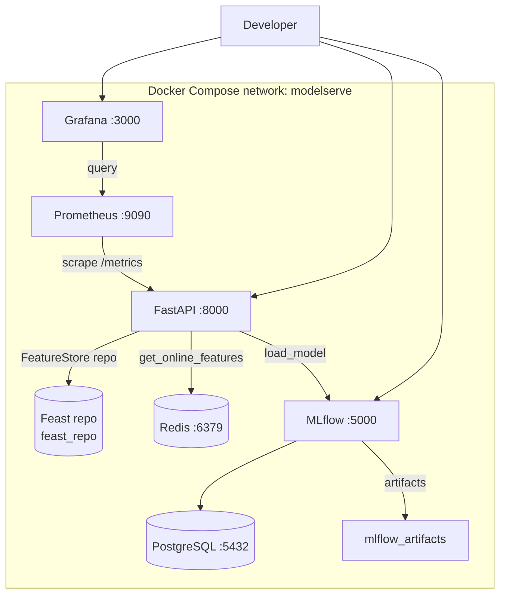
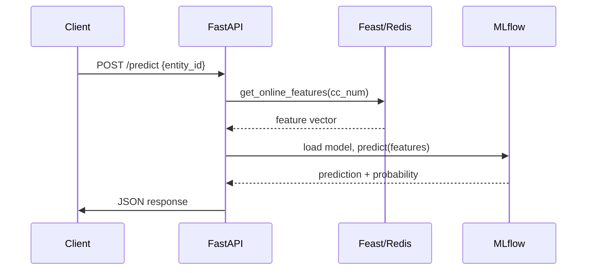
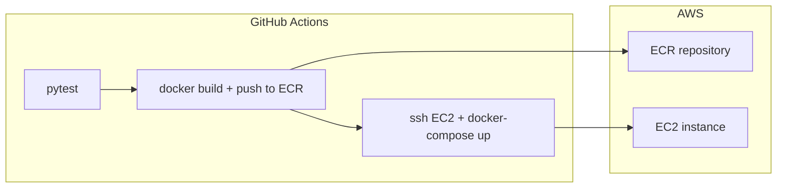

# Architecture

## Overview

**ModelServe** is a fraud detection inference API. Client sends credit card number → FastAPI fetches features from Redis (Feast) → runs model from MLflow → returns prediction.

## Components

| Component | Technology | Purpose |
|-----------|------------|---------|
| API | FastAPI | Serves predictions at `/predict` |
| Model Registry | MLflow | Stores trained models, tracks experiments |
| Feature Store | Feast + Redis | Fast feature lookups at inference time |
| Monitoring | Prometheus + Grafana | Metrics, dashboards, alerts |
| Database | PostgreSQL | MLflow metadata storage |
| CI/CD | GitHub Actions | Test → Build → Deploy to AWS |

## Architecture Diagrams

### Local Development (Docker Compose)

### Prediction Request Flow

### CI/CD Pipeline

## Key Files

| File | Purpose |
|------|---------|
| `app/main.py` | FastAPI routes: `/health`, `/predict`, `/metrics` |
| `app/model_loader.py` | Loads model from MLflow registry |
| `app/feature_client.py` | Fetches features from Feast/Redis |
| `app/metrics.py` | Prometheus metrics definitions |
| `training/train.py` | Trains and registers model |
| `feast_repo/feature_store.yaml` | Feast configuration |
| `docker-compose.yml` | Local stack definition |
| `.github/workflows/deploy.yml` | CI/CD pipeline |
| `infrastructure/__main__.py` | Pulumi AWS infrastructure |

## Environment Variables

| Variable | Default | Purpose |
|----------|---------|---------|
| `MLFLOW_TRACKING_URI` | http://localhost:5000 | MLflow server |
| `MODEL_NAME` | FraudDetector | Model in registry |
| `MODEL_STAGE` | Production | Stage to load |
| `FEAST_REPO_PATH` | ./feast_repo | Feast project path |
| `POSTGRES_USER` | mlflow | Database user |

## Alert Rules

| Alert | Condition |
|-------|-----------|
| ServiceDown | `up{job="fastapi"} == 0` for 1m |
| HighPredictionLatency | p95 > 1s for 5m |
| HighErrorRate | errors/requests > 5% for 2m |

## Related

- See **[SHOWCASE.md](../SHOWCASE.md)** for how-to-demo
- See **[diagrams/](diagrams/)** for exporting diagrams