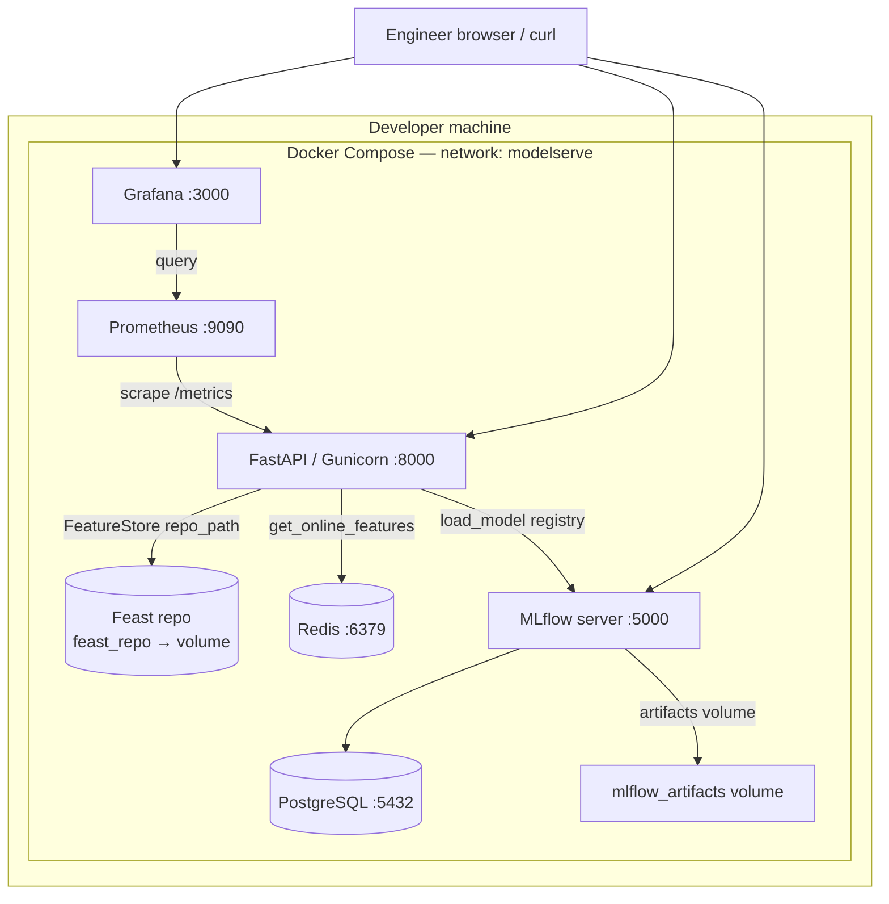
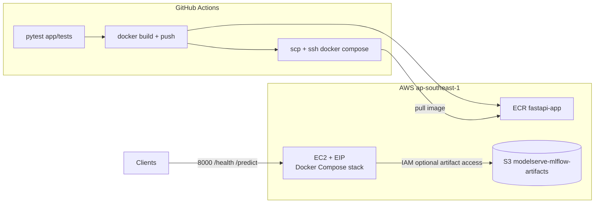
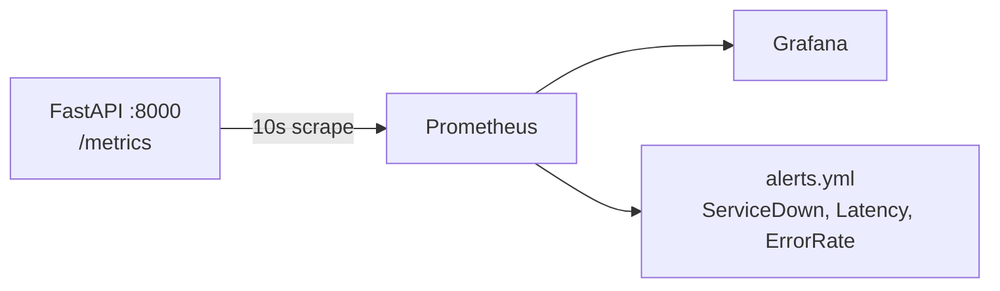

# ModelServe — Engineering Documentation

> **Graded deliverable.** This document describes the fraud-detection inference stack end to end: components, networks, CI/CD, operations, and trade-offs.

---

## 1. System Overview

**ModelServe** is an HTTP inference API for credit-card fraud scoring. A client sends a transaction entity identifier (`entity_id`, mapped to `cc_num` in the Kaggle-style dataset). The service loads the latest features for that card from **Feast** (Redis online store), runs a **scikit-learn** model loaded from the **MLflow** Model Registry, and returns a binary prediction with probability and metadata.

The system is aimed at learners and capstone reviewers who need a realistic but compact MLOps path: train and register a model, materialize features, serve predictions, observe latency and errors in **Prometheus** / **Grafana**, and deploy to **AWS** (ECR + EC2) with **GitHub Actions**.

**Design philosophy**

- **Single-node production footprint:** One EC2 instance runs Docker Compose (FastAPI, MLflow, Postgres, Redis, Prometheus, Grafana). This minimizes cost and operational surface area for a classroom capstone; horizontal scaling and managed Kubernetes are explicitly out of scope.
- **Clear separation of concerns:** Training (`training/`) produces registry artifacts; serving (`app/`) only loads a staged model URI and reads features from Feast; infrastructure (`infrastructure/`) is declarative Pulumi.
- **Observable defaults:** Prometheus scrapes `/metrics`; alert rules encode service-down, latency, and error-rate signals (see §2.5 and ADR-5).

**Tech stack (summary)**

| Layer | Technology |
|-------|------------|
| API | FastAPI, Gunicorn + Uvicorn workers |
| Model lifecycle | MLflow Tracking + Model Registry, PostgreSQL backend, artifacts (volume locally; S3-capable via IAM on EC2) |
| Features | Feast, Redis online store, file offline store (local) |
| Observability | prometheus-client, Prometheus, Grafana |
| IaC | Pulumi (Python), AWS VPC / EC2 / S3 / ECR / IAM |
| CI/CD | GitHub Actions: test → build/push to ECR → SSH deploy to EC2 |

---

## 2. Architecture Diagram(s)

### 2.1 Local development (Docker Compose)

All services share the bridge network `modelserve`. Service DNS names match Docker Compose service names.



**Ports (published to host)**

| Service | Host port | Protocol | Purpose |
|---------|-----------|----------|---------|
| postgres | 5432 | TCP | MLflow backend DB |
| redis | 6379 | TCP | Feast online store |
| mlflow | 5000 | HTTP | Tracking UI + registry |
| fastapi | 8000 | HTTP | Inference API |
| prometheus | 9090 | HTTP | Metrics + alerts |
| grafana | 3000 | HTTP | Dashboards |

### 2.2 Production / cloud topology (AWS + GitHub Actions)

Pulumi provisions a VPC, public subnet, internet gateway, security group, Ubuntu EC2 (`t3.small`), Elastic IP, S3 bucket for MLflow-related artifacts naming, and ECR repository `fastapi-app`. The instance user data installs Docker, Compose, and AWS CLI. Operators copy `docker-compose.yml`, `monitoring/`, `feast_repo/`, and `.env` to the host and run the same stack as locally. CI builds the API image, pushes to ECR, and SSH pulls/restarts.



**Network boundaries**

- **Inside EC2:** Containers talk over the Compose network (same as §2.1).
- **Internet:** Security group opens 22, 3000, 5000, 8000, 9090 from `0.0.0.0/0` (convenient for demos; should be restricted in real production).

### 2.3 Prediction request path (logical)

```mermaid
sequenceDiagram
  participant C as Client
  participant A as FastAPI
  participant F as Feast / Redis
  participant M as MLflow model
  participant P as Prometheus

  C->>A: POST /predict or GET /predict/{id}
  A->>F: FeatureStore.get_online_features(cc_num)
  F-->>A: feature vector (Feast row or client defaults)
  Note over A: 404 only if features is None; FeatureClient often returns defaults on miss
  A->>M: ModelLoader.predict(features)
  M-->>A: prediction + probability
  A->>P: record metrics (histogram / counters)
  A-->>C: JSON PredictResponse
```

### 2.4 Monitoring data path



**Dashboard intent:** `monitoring/grafana/dashboards/modelserve.json` visualizes inference traffic, latency, Feast hits/misses, and model version—enough to debug “slow” vs “wrong features” vs “model not loaded.”

**Alert thresholds (as implemented)**

| Alert | Intent |
|-------|--------|
| `ServiceDown` | `up{job="fastapi"} == 0` for 1m — scrape target unreachable |
| `HighPredictionLatency` | p95 of `prediction_duration_seconds` > 1s for 5m |
| `HighErrorRate` | ratio of error counter to request counter > 5% for 2m |

---

## 3. Architecture Decision Records (ADRs)

### ADR-1: Deployment topology

**Context:** The capstone must run on student budgets and be gradable without a full platform team.

**Decision:** Deploy the full stack on **one EC2 instance** via Docker Compose, with **Pulumi** creating VPC, subnet, SG, EC2, EIP, S3, and ECR.

**Rationale:** Mirrors local dev exactly, reduces “works on my machine” issues, and avoids Kubernetes complexity. Elastic IP gives a stable address for CI health checks and demos.

**Trade-offs:** No auto-scaling or AZ redundancy; EC2 outage means total outage. Security group allows broad ingress for lab convenience (SSH and UIs exposed).

---

### ADR-2: CI/CD strategy

**Context:** Need automated tests and repeatable deploys from `main`.

**Decision:** **GitHub Actions** pipeline: on push/PR to `main`, install Python 3.12 dependencies and run `pytest`. On **push to `main` only**, build Docker image, tag `latest` and `$GITHUB_SHA`, push to ECR, then **SSH + scp** to EC2: copy compose files and configs, ECR login on host, `docker-compose pull && up -d`, then `curl` health.

**Rationale:** Matches common small-team patterns; reuses the same compose definition as local. Image immutability per commit via SHA tag supports rollback mentally even if the deploy script always pulls `latest` first.

**Trade-offs:** Deploy job is sequential; no blue/green. Failed deploy may leave partial state unless compose handles it. Secrets must be maintained in GitHub (ECR registry URL, AWS keys, EC2 SSH key, host).

---

### ADR-3: Data architecture

**Context:** MLflow needs durable metadata; Feast needs low-latency feature reads at inference time.

**Decision:**

- **PostgreSQL** for MLflow backend store (experiments, registered model metadata).
- **Redis** for Feast **online** store (sub-millisecond class lookups on hot paths).
- **Local file** offline store in `feature_store.yaml` for development; production could move to S3/Snowflake-style stores without changing the API contract.
- **S3 bucket** (`modelserve-mlflow-artifacts` in Pulumi) for long-lived artifact storage aligned with AWS; local compose uses a named volume for simplicity.

**Rationale:** Postgres is the MLflow default for serious metadata; Redis is the standard Feast online backend for tutorials and small deployments.

**Trade-offs:** Redis data must be populated (`feast materialize` / pipelines); if Redis is empty, Feast lookups fail or fall back depending on client logic. Single Redis instance is not HA.

---

### ADR-4: Containerization

**Context:** Production image must be runnable without a dev virtualenv and should stay maintainable.

**Decision:** **Multi-stage Dockerfile**: builder stage (`python:3.12-slim`) installs build deps (`gcc`, `libpq-dev`) and `pip install --prefix=/install`; runtime stage copies `/install`, minimal runtime libs (`libpq5`, `curl`), app and `feast_repo`, runs as **non-root** `appuser`, **HEALTHCHECK** on `/health`, **CMD** is Gunicorn with **UvicornWorker** (2 workers, 120s timeout).

**Rationale:** Smaller attack surface than running as root; separates compile-time deps from runtime; matches FastAPI ASGI deployment guidance.

**Trade-offs:** Image still bundles full ML/FEAST stack from `requirements.txt` (can be large). Builder stage increases build time.

---

### ADR-5: Monitoring design

**Context:** Operators need to know if the API is up, slow, or error-prone.

**Decision:** Expose **Prometheus** metrics from `app/metrics.py` (request count, duration histogram, errors, Feast hits/misses, model version gauge). Prometheus scrapes every 10s; **Grafana** provisions a datasource and a ModelServe dashboard; **alert rules** cover downtime, high p95 latency, and elevated error ratio.

**Rationale:** Pull-based metrics fit containerized services; histogram buckets (0.01–10s) suit interactive fraud checks.

**Trade-offs:** `HighErrorRate` compares `prediction_errors_total` to `prediction_requests_total`; counters increment on different paths—operators should validate ratio semantics in load tests. No Alertmanager wiring in compose (alerting section points to empty static_configs).

---

## 4. CI/CD Pipeline Documentation

**Workflow file:** `.github/workflows/deploy.yml`

| Trigger | Jobs run |
|---------|----------|
| `push` or `pull_request` to `branch: main` | **Test** |
| `push` to `main` only | **Test** → **Build and Push** → (on same push) **Deploy** after build |

**Job: Test**

1. Checkout.
2. Setup Python 3.12.
3. `pip install -r requirements.txt`.
4. `pytest app/tests/ -v`.

**Job: Build and Push** (`if: github.ref == 'refs/heads/main'`)

1. Configure AWS credentials from secrets.
2. ECR login.
3. `docker build` twice: `latest` and `$GITHUB_SHA`; push both.

**Job: Deploy** (`needs: build-and-push`, `if: main`)

1. Checkout, AWS config, ECR login.
2. `ssh-keyscan` EC2 host into `known_hosts`.
3. `scp` `docker-compose.yml`, `monitoring/`, `feast_repo/`, `.env` to EC2 home.
4. SSH: ECR docker login, `docker-compose pull && docker-compose up -d`.
5. Sleep 30s; `curl -f http://$EC2_HOST:8000/health`.

**Required GitHub secrets (names only)**

| Secret | Purpose |
|--------|---------|
| `AWS_ACCESS_KEY_ID` | Push to ECR, CLI on runner |
| `AWS_SECRET_ACCESS_KEY` | Pair for above |
| `ECR_REGISTRY` | Registry host for `docker tag` / login |
| `EC2_HOST` | Public IP or DNS for SSH and health URL |
| `EC2_USER` | SSH user (e.g. `ubuntu`) |
| `EC2_SSH_KEY` | Private key PEM for `scp`/`ssh` |

**Failures:** pytest failure blocks later jobs on PRs (build/deploy only on `main` after test success). Deploy failure fails the workflow; EC2 may need manual inspection (`docker compose ps`, logs).

**Typical duration:** Tests ~1–3 minutes depending on dependency cache; build/push varies with layer cache; deploy includes 30s sleep—order of **5–15 minutes** end to end for a cold run.

---

## 5. Runbook

### 5.1 Bootstrapping from a fresh clone

1. Clone the repository and open a terminal at the repo root.
2. Copy environment template: `cp .env.example .env` and fill AWS keys if using S3/ECR or remote MLflow artifacts.
3. **Local full stack:** ensure Docker Engine + Compose plugin; run `docker compose up -d` (see `docker-compose.yml`). Wait for healthchecks (Postgres → MLflow → Redis → FastAPI).
4. **Feast:** ensure the registry exists and online store is populated per course instructions (`feast apply`, feature materialization scripts under `scripts/` and `training/` as applicable).
5. **Model:** run training (`training/train.py`) with MLflow reachable so a **Production**-staged model exists for `MODEL_NAME` / `MODEL_STAGE` in `.env`.
6. Verify: `curl http://localhost:8000/health` and a sample `POST /predict` with a known `entity_id`.
7. **AWS:** from `infrastructure/`, configure Pulumi AWS credentials and `pulumi up`; note outputs `instance_ip`, `ecr_repository_url`, `s3_bucket_name`. Configure GitHub secrets for CI.

### 5.2 Deploying a new model version

1. Train and register the new version in MLflow; transition the desired version to **Production** (or adjust `MODEL_STAGE` if using Staging).
2. Restart the FastAPI container so startup runs `ModelLoader.load()` again: `docker compose restart fastapi` (on EC2 or locally). For zero-downtime beyond this scope, use two-instance patterns or rolling updates.
3. Confirm `model_version` in `/health` and Grafana gauge `model_version_info`.

### 5.3 Common failure recovery

| Symptom | Checks | Mitigation |
|---------|--------|------------|
| **503 Model not loaded** | MLflow up? Model name/stage correct? Registry has Production model? | Fix URI/credentials; train/register; restart FastAPI |
| **404 No features** (if `get_features` returns `None`) | Rare with current client (defaults used instead); wrong contract if code changes | Align `FeatureClient` with API expectations; materialize Redis / `feast apply` |
| **FastAPI crash loop** | `docker compose logs fastapi` | Import errors, missing env, Feast path wrong |
| **S3 permission errors on EC2** | IAM instance profile policies | Pulumi attaches S3 and ECR policies; verify bucket name and region |
| **Pulumi state issues** | Backend configuration | Use consistent backend; `pulumi refresh`; avoid editing state by hand |
| **Redis data “lost”** | Volume removed or new container | Re-run feature materialization to repopulate online store |

### 5.4 Teardown

1. **Local:** `docker compose down -v` (drops volumes—destructive to local DB/Redis/MLflow data).
2. **AWS:** from `infrastructure/`, `pulumi destroy` (ECR repo has `force_delete: true` to allow removal with images). Manually verify S3 bucket empty if deletion blocked by policy.
3. **GitHub:** revoke or rotate secrets if the environment is discarded.

---

## 6. Known Limitations

- **Single point of failure:** One EC2 host; no multi-AZ or load-balanced API tier in this repo.
- **Security group:** Wide open ingress on multiple ports—acceptable for a lab, not for regulated production.
- **Feast / MLflow coupling:** Inference depends on external services; no circuit breaker pattern in the API beyond HTTP error codes.
- **Alert ratio:** Error-rate alert may not reflect intuitive “% of HTTP failures” until counter semantics are validated under load.
- **Feast optional import:** If Feast fails to import at runtime, `FeatureClient` degrades (see application logs); tests mock dependencies.
- **`.env.example`:** Still contains TODO-style comments in upstream template; real deployments should document every variable in one place (this doc + example file).

---

## 7. Related files (quick reference)

| Path | Role |
|------|------|
| `app/main.py` | FastAPI routes: `/health`, `/predict`, `/metrics` |
| `app/model_loader.py` | MLflow registry load + `predict` |
| `app/feature_client.py` | Feast online features |
| `app/metrics.py` | Prometheus instrumentation |
| `docker-compose.yml` | Local stack topology |
| `Dockerfile` | Production API image |
| `infrastructure/__main__.py` | AWS resources |
| `.github/workflows/deploy.yml` | CI/CD |
| `monitoring/prometheus/*.yml` | Scrape + alerts |
| `feast_repo/feature_store.yaml` | Feast project + Redis |

For command-line testing steps, see `guide/command.md`.
